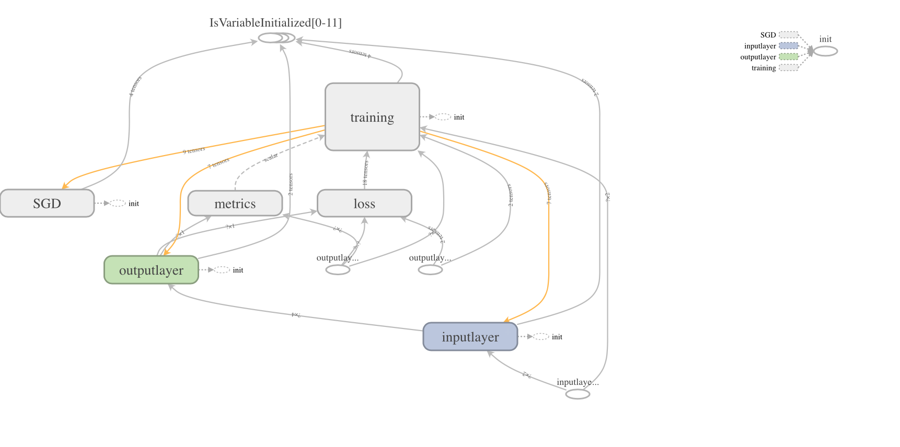
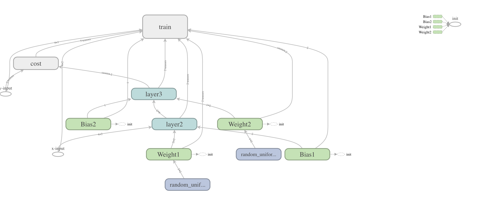

# uTensor Workshop

[Why Machine Learning on The Edge?](https://towardsdatascience.com/why-machine-learning-on-the-edge-92fac32105e6)

## Teil 1 - Keras Überblick und erstes ML Modell

```sh
git clone https://github.com/choas/uTensor_workshop.git
cd uTensor_workshop
```

### Ziel Jupyter Notebooks installieren

__Python 2.7__ sollte bereits installiert sein, ansonsten: [Download Python 2.7.16](https://www.python.org/downloads/release/python-2716/)

#### [Virtualenv](https://virtualenv.pypa.io/en/latest/) installieren

```sh
pip install virtualenv
```

```sh
cd python
virtualenv . -p <PYTHON2.7>  # oder nur virtualenv .
source bin/activate
python --version
```

#### noch mehr Python installieren

TensorFlow, Keras, Jupyter und TensorFlow.js installieren:

```sh
pip install -r requirement.txt
```

#### TensorFlow und Keras Versionen

1. Keras + TensorFlow = 🤬
2. [Welche Version passt mit welcher Version zusammen?](https://docs.floydhub.com/guides/environments/)
3. [Sunsetting tf.contrib](https://github.com/tensorflow/community/blob/master/rfcs/20180907-contrib-sunset.md)

#### Jupyter Notebook starten

```sh
cd notebooks
jupyter notebook
```

Der (Default) Browser öffnet automatisch die Seite [http://localhost:8888](http://localhost:8888)

## Erstes Beispiel mit [Keras](https://keras.io/)

Was ist supervised und unsupervised learning?

[01_XOR_Keras.ipynb](http://localhost:8888/notebooks/01_XOR_Keras.ipynb) öffnen und mit _Run_ das Notebook Schritt für Schritt ausführen.

### TensorBoard

```sh
cd python
source bin/activate
tensorboard --logdir notebooks/logs
```

Im Browser die Seite [http://localhost:6006/](http://localhost:6006/) öffnen.



### Modell verbessern

Wie können wir das Modell verbessern?

- activation: ReLu im ersten Layer
- loss: binary_crossentropy
- optimizer: Adam
- layer: zwischen 1. und 2. layer

## Teil 2 - XOR Modell mit [TensorFlow](https://www.tensorflow.org/)

[9 Things You Should Know About TensorFlo](https://hackernoon.com/9-things-you-should-know-about-tensorflow-9cf0a05e4995)

[02_XOR_TF.ipynb](http://localhost:8888/notebooks/02_XOR_TF.ipynb) öffnen und mit _Run_ das Notebook Schritt für Schritt ausführen (Original: [Solving XOR with a Neural Network in TensorFlow](https://aimatters.wordpress.com/2016/01/16/solving-xor-with-a-neural-network-in-tensorflow/))

Tensorflow Operator:

- placeholder
- Variable
- sigmoid  ⚠️
- reduce_mean
- GradientDescentOptimizer



### mehr Modelle

- [Keras examples](https://github.com/keras-team/keras/tree/master/examples
)
- [TensorFlow models](https://github.com/tensorflow/models/tree/master/research)

## Teil 3 - [TensorFlow.js](https://www.tensorflow.org/js/)

Beispiel: [Train a model in tf.keras with Colab, and run it in the browser with TensorFlow.js](https://medium.com/tensorflow/train-on-google-colab-and-run-on-the-browser-a-case-study-8a45f9b1474e)

- [TensorFlow.js Examples](https://github.com/tensorflow/tfjs-examples)

### Convert TensorFlow SavedModel and Keras models to TensorFlow.js

- [TensorFlow.js Version 0.8.0](https://pypi.org/project/tensorflowjs/0.8.0/)
- [@tensorflow/tfjs](https://www.jsdelivr.com/package/npm/@tensorflow/tfjs)
- [tfjs-converter](https://github.com/tensorflow/tfjs-converter)

```sh
cd python/notebooks/web/
python -m SimpleHTTPServer 8000
```

Im Browser öffnen: [http://localhost:8000/](http://localhost:8000/)

### Save Modelle

- [remove_training_nodes](rhttps://www.tensorflow.org/api_docs/python/tf/graph_util/remove_training_nodes)
- [convert_variables_to_constants](https://www.tensorflow.org/api_docs/python/tf/graph_util/convert_variables_to_constants)

### MNIST


- [TensorFlow.js Example: MNIST CNN Transfer Learning Demo](https://github.com/tensorflow/tfjs-examples/tree/master/mnist-transfer-cnn)
- [See this example live!](https://storage.googleapis.com/tfjs-examples/mnist-transfer-cnn/dist/index.html)

#### Notebook

[03_MNIST_TF.ipynb](http://localhost:8888/notebooks/03_MNIST_TF.ipynb) öffnen und mit _Run_ das Notebook Schritt für Schritt ausführen.

more: [Machine Learning is Fun! Part 3: Deep Learning and Convolutional Neural Networks](https://medium.com/@ageitgey/machine-learning-is-fun-part-3-deep-learning-and-convolutional-neural-networks-f40359318721
)

## Teil 4 - uTensor

👉 __[Simple Neural Network on MCUs](https://blog.hackster.io/simple-neural-network-on-mcus-a7cbd3dc108c)__ 👈


### mbed


- [An introduction to Arm Mbed OS 5](https://os.mbed.com/docs/mbed-os/v5.12/introduction/index.html)
- [Github](https://github.com/ARMmbed/mbed-os)

### Nucleo F411RE

- [NUCLEO-F411RE (mbed)](https://os.mbed.com/platforms/ST-Nucleo-F411RE/)
- [STM](https://www.st.com/content/st_com/en/products/evaluation-tools/product-evaluation-tools/mcu-eval-tools/stm32-mcu-eval-tools/stm32-mcu-nucleo/nucleo-f411re.html)
- [STM32 F4 (Wikipedia)](https://en.wikipedia.org/wiki/STM32#STM32_F4)

### Installation ⏳

(Alternative [Cloud9 Installer](https://github.com/uTensor/cloud9-installer) ???)

```sh
cd python
source bin/activate
```

GCC-arm cross-compiler:

```sh
brew install https://raw.githubusercontent.com/osx-cross/homebrew-arm/0a6179693c15d8573360c94cee8a60bdf142f7b4/arm-gcc-bin.rb
```

```sh
brew install mercurial git
```

```sh
pip install mbed-cli==1.9.1 utensor_cgen
```

[tensorflow/models/issues/3995](https://github.com/tensorflow/models/issues/3995):

```sh
pip install -U protobuf
```

### MNIST Beispiel

```sh
cd ../code
mbed new MNIST
cd MNIST
mbed add https://github.com/uTensor/uTensor
```

#### uTensor convert

```sh
utensor-cli convert ../../python/notebooks/models/deep_mlp.pb --output-nodes=y_pred
```

```sh
mbed compile -m nucleo_f411re -t GCC_ARM --profile=uTensor/build_profile/release.json
```

#### FIX mbed

In der `mbed-os/platform/mbed_rtc_time.h` Datei die Zeilen löschen (siehe [issues/6988](https://github.com/ARMmbed/mbed-os/issues/6988):

```c
#if !defined(__GNUC__) || defined(__CC_ARM) || defined(__clang__)
```

```c
#endif
```

#### Upload

```sh
cp ./BUILD/NUCLEO_F411RE/GCC_ARM-RELEASE/MNIST.bin /Volumes/
```

```sh
screen /dev/cu.usbmodem14603 115200
```

- control AK
- Reset Board

### mbed XOR (sigmoid)

```sh
mbed new XOR
mbed add https://github.com/uTensor/uTensor
```

```sh
utensor-cli convert ../../python/notebooks/models/xor_tf.pb --output-nodes=layer3/Sigmoid
```

unsupported op type in uTensor: Sigmoid

### mbed XOR (relu)

[04_XOR_TF_relu.ipynb](http://localhost:8888/notebooks/04_XOR_TF_relu.ipynb) öffnen und mit _Run_ das Notebook Schritt für Schritt ausführen.

```sh
utensor-cli convert ../../python/notebooks/models/xor_relu.pb --output-nodes=add_1
```

Softmax:

- [TensorFlow Softmax](https://www.tensorflow.org/api_docs/python/tf/nn/softmax)
- [Wikipedia](https://de.wikipedia.org/wiki/Softmax-Funktion)

### uTensor Dateien

- models/*
- main.cpp

### compile

```sh
mbed compile -m nucleo_f411re -t GCC_ARM --profile=uTensor/build_profile/release.json
```

### Pins


- [DigitalIn](https://os.mbed.com/docs/mbed-os/v5.11/apis/digitalin.html)
- [DigitalOut (LED)](https://os.mbed.com/docs/mbed-os/v5.11/apis/digitalout.html)

### weitere uTensor Beispiele

- [ADL demo](https://github.com/uTensor/ADL_demo)
- [CMSIS example](https://github.com/uTensor/utensor-cmsis-example)
- [MNIST Demo DISCO_F413ZH](https://github.com/uTensor/utensor-mnist-demo)

